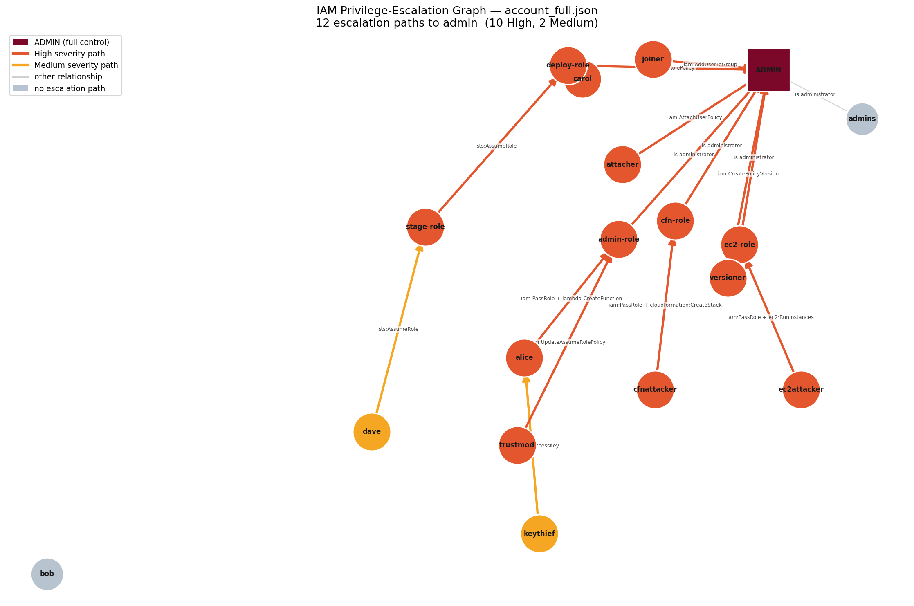

# IAM Privilege-Escalation Graph Analyzer

Detect hidden privilege-escalation paths in AWS IAM through graph-based analysis.

IAM permissions are usually reviewed one policy at a time, but real escalation
comes from *combinations* of individually reasonable-looking permissions spread
across users, roles, and groups. This tool models an entire account as a directed
graph of "who can gain control over whom," runs 23 documented escalation
techniques against it, follows multi-hop chains, ranks each finding by severity,
and renders the result.

> Course project for DD2391 (Cybersecurity Project), KTH Royal Institute of Technology.



*Escalation paths detected in a sample account: red = High, amber = Medium, gray = no path; each edge is labeled with the IAM permission that enables the hop.*

## Features

- **23 escalation techniques** across five families (policy self-grant, credential
  theft, trust-policy manipulation, PassRole-to-compute, role chaining) — the
  Rhino Security Labs catalogue, the same set PMapper and Pacu implement.
- **Multi-hop detection** — escalation is a path search to an `ADMIN` node, so
  chains no single rule describes (e.g. *assume a role that can make itself admin*)
  are found automatically.
- **Risk scoring** — every path is labeled High / Medium / Low from hop count and
  blast radius.
- **Graph visualization** — findings rendered with severity-colored, permission-
  labeled edges.
- **Tested** — 100% precision and recall with zero false positives on synthetic
  fixtures; all 23 rules exercised.

## Pipeline

| Stage | File | What it does |
|-------|------|--------------|
| 1. Parse | `parser.py` | IAM policy JSON → queryable permission facts (`allows()`) |
| 2. Graph | `graph.py` | build the "who can control whom" graph + path search |
| 3. Rules | `rules.py` | 23 escalation-technique rules |
| 4. Score | `scoring.py` | High / Medium / Low per path |
| 5. Visualize | `visualize.py` | render the severity graph to PNG |

## Install

```bash
git clone <your-repo-url>
cd iam-analyzer
python3 -m venv venv
source venv/bin/activate
pip install networkx matplotlib
```

`networkx` is required for stages 2–4; `matplotlib` only for the visualization.
The parser has no third-party dependencies.

## Usage

```bash
# Detect escalation paths in an account and print them, ranked by severity
python3 graph.py account_full.json

# Render the findings as a colored graph
python3 visualize.py account.json escalation_graph.png

# Run the evaluation harness (precision / recall / false positives)
python3 evaluate.py
```

### Input format

A single JSON file describing an account's identities and their policies — a
simplified shape of `aws iam get-account-authorization-details`:

```json
{
  "account_id": "123456789012",
  "identities": [
    {
      "name": "alice",
      "type": "user",
      "policy": { "Statement": [
        { "Effect": "Allow", "Action": "lambda:CreateFunction", "Resource": "*" },
        { "Effect": "Allow", "Action": "iam:PassRole",
          "Resource": "arn:aws:iam::123456789012:role/admin-role" }
      ] }
    }
  ]
}
```

Roles may also carry a `trust_policy`. See `tests/`/`fixtures/` and the sample
`account.json` / `account_full.json` for worked examples.

### Example output

```
[High  ] (2-hop) alice
      --[ iam:PassRole + lambda:CreateFunction ]-->  admin-role
      --[ is administrator ]-->  effective ADMIN

[Medium] (3-hop) dave
      --[ sts:AssumeRole ]-->  stage-role
      --[ sts:AssumeRole ]-->  deploy-role
      --[ iam:AttachRolePolicy ]-->  effective ADMIN
```

## Escalation techniques

| Family | Rules |
|--------|-------|
| A — Policy / self-grant | AttachUser/Role/GroupPolicy, PutUser/Role/GroupPolicy, CreatePolicyVersion, SetDefaultPolicyVersion, AddUserToGroup |
| B — Credential theft | CreateAccessKey, CreateLoginProfile, UpdateLoginProfile |
| C — Trust-policy manipulation | UpdateAssumeRolePolicy |
| D — PassRole-to-compute | Lambda, EC2, CloudFormation, Glue, DataPipeline, SageMaker, CodeBuild, ECS, UpdateFunctionCode |
| E — Role chaining | AssumeRole |

Adding a technique means writing one `@rule`-decorated function in `rules.py`.

## Testing

```bash
python3 make_fixtures.py   # (re)build the test fixtures
python3 evaluate.py        # run the evaluation
```

| Fixture | Precision | Recall | False positives | Rules exercised |
|---------|-----------|--------|-----------------|-----------------|
| vulnerable (25 planted chains) | 100% | 100% | 0 | 23 / 23 |
| clean baseline | 100% | 100% | 0 | 0 / 23 |

The clean baseline includes deliberate "near miss" identities (half a chain) to
guard against false positives.

## Roadmap

- [ ] OIDC / federated-identity modeling (e.g. GitHub Actions web-identity
      federation) and trust-policy misconfiguration rules (wildcard `sub`/`aud`).
- [ ] Sandbox verification — attempt a subset of flagged paths in a live AWS
      account (`boto3`) to confirm real exploitability.
- [ ] Left-to-right layered graph layout.

## Limitations

Static analysis does not (yet) evaluate `NotAction`/`NotResource`, IAM condition
keys (outside the planned OIDC rules), service control policies, or permission
boundaries. These are documented blind spots and the target of the sandbox-
verification stage.

## References

- Rhino Security Labs — *AWS IAM Privilege Escalation Methods*
- NCC Group / PMapper — principal-mapping edge definitions
- Pacu — AWS exploitation framework

## License

MIT (or as required by the course).
